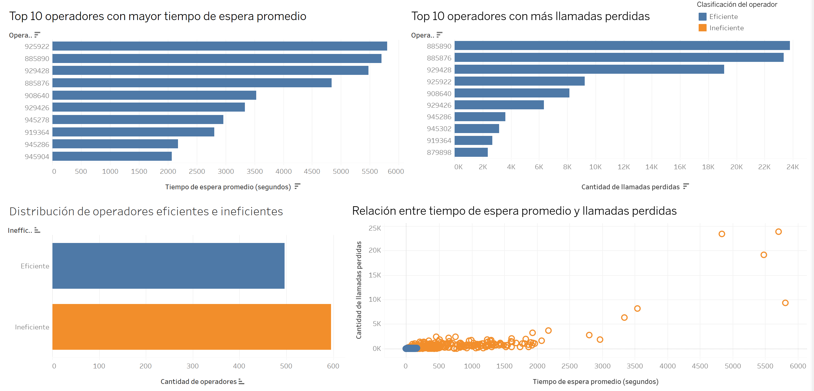

# 📊 Análisis del desempeño de operadores de telecomunicaciones

## Descripción

Este proyecto analiza el desempeño de operadores de telecomunicaciones utilizando métricas operativas para identificar oportunidades de mejora y apoyar la toma de decisiones basada en datos.

## Objetivo

Identificar operadores con bajo desempeño mediante el análisis de métricas operativas para proponer oportunidades de mejora.

## Herramientas utilizadas

- Python
- Pandas
- Tableau
- Jupyter Notebook

## Archivos del proyecto

- analisis-operadores-telecom.ipynb
- operator_metrics.csv
- dashboard-tableau.twbx
- presentacion-proyecto.pdf

## Dashboard

El dashboard permite visualizar:

- Operadores con mayor tiempo de espera.
- Operadores con más llamadas perdidas.
- Distribución de operadores eficientes e ineficientes.
- Relación entre tiempo de espera y llamadas perdidas.

## Conclusiones

El análisis permitió identificar operadores con bajo desempeño y visualizar patrones que apoyan la toma de decisiones basada en datos.
